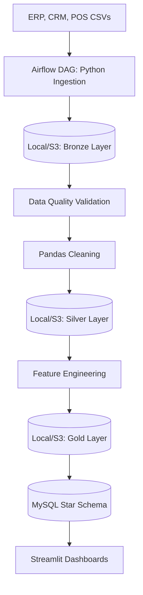

# DataFlowX - Enterprise Data Platform


DataFlowX is a complete, production-grade enterprise data platform designed using the **Medallion Architecture** (Bronze, Silver, Gold). It ingests data from mock enterprise systems (ERP, CRM, POS), validates it using a custom Data Quality framework, transforms it, and loads it into a Star Schema Data Warehouse.

This project demonstrates Principal Data Engineering skills including Apache Airflow orchestration, incremental loading, metadata tracking, and data visualization.

---

## 🚀 Features

- **Medallion Architecture**: Segregation of data into Raw (Bronze), Clean (Silver), and Business (Gold) layers.
- **Apache Airflow**: Complete DAG scheduling and orchestration of the ETL process.
- **Data Quality Framework**: Automated Great-Expectations-style validation.
- **Incremental Loading**: State management and watermark tracking stored in MySQL.
- **Storage Abstraction**: Seamlessly toggle between AWS S3 and Local file storage.
- **Star Schema Warehouse**: Optimized Fact and Dimension tables in MySQL.
- **Streamlit Analytics**: Interactive dashboards for Sales, Customers, and Inventory KPIs.

---

## 🏗️ Architecture



---

## 🛠️ Tech Stack
- **Languages**: Python, SQL
- **Data Processing**: Pandas, NumPy
- **Orchestration**: Apache Airflow
- **Database**: MySQL, SQLAlchemy
- **Infrastructure**: Docker, Docker Compose
- **Visualization**: Streamlit, Plotly

---

## ⚙️ Local Setup & Installation

### Prerequisites
- Docker and Docker Compose installed.
- Python 3.10+ (if running locally without Docker).

### Step-by-Step Guide

1. **Clone the Repository**
   Navigate to the project root.

2. **Set up Environment Variables**
   Copy the example environment file:
   ```bash
   cp .env.example .env
   ```
   *(By default, `STORAGE_BACKEND=local` is set so no AWS keys are required).*

3. **Generate Mock Enterprise Data**
   Since this simulates a real company, you need to generate the source data:
   ```bash
   python -m venv venv
   source venv/bin/activate  # On Windows: .\venv\Scripts\activate
   pip install -r requirements.txt
   python data/generate_mock_data.py
   ```

4. **Launch Infrastructure (Docker)**
   Start MySQL, Airflow, and Streamlit:
   ```bash
   docker-compose up -d
   ```

5. **Run the ETL Pipeline via Airflow**
   - Open Airflow UI: `http://localhost:8080` (User: `admin`, Password: `admin`)
   - Unpause and trigger the `dataflowx_enterprise_pipeline` DAG.
   - Watch the logs as data flows from Bronze -> Silver -> Gold -> MySQL.

6. **View the Dashboards**
   - Open Streamlit UI: `http://localhost:8501`
   - Navigate between Sales, Customer, and Inventory analytics.

---

## 📂 Project Structure
- `/airflow`: DAGs and orchestration logic.
- `/data`: Source CSVs mimicking enterprise systems.
- `/data_lake`: Local fallback storage representing S3 (Bronze/Silver/Gold).
- `/dashboards`: Streamlit application.
- `/transformations` & `/feature_engineering`: Pandas business logic.
- `/metadata`: Watermark tracking for incremental loads.
- `/sql`: DDL for the Star Schema data warehouse.
- `/tests`: Pytest suite.

---

## 📝 Interview Preparation
If you are reviewing this project for an interview, please read `docs/interview_prep.md` for detailed architectural tradeoffs, STAR method explanations, and anticipated questions.
