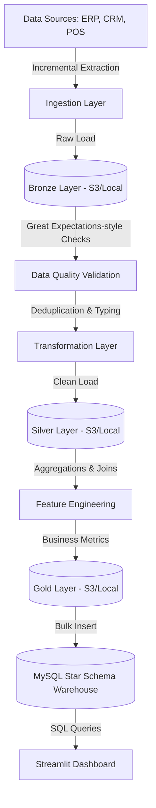

# DataFlowX Master Project Guide

*Prepared by: Senior Staff Data Engineer & Technical Interview Coach, Amazon*

This guide is designed to help you deconstruct, understand, and confidently defend the **DataFlowX Enterprise Data Platform** in rigorous technical interviews at top-tier companies.

---

## SECTION 1: EXECUTIVE PROJECT OVERVIEW

### What DataFlowX Is
DataFlowX is a production-grade, end-to-end enterprise data platform. It extracts raw data from varied business systems (ERP, CRM, POS), validates and cleanses it using a Medallion Architecture, and orchestrates the entire lifecycle via Apache Airflow. Finally, it aggregates the data into a Star Schema Data Warehouse to power executive Streamlit dashboards.

### Business Problem Solved
Enterprises often suffer from **Data Silos**. Sales data lives in an ERP, customer data in a CRM, and transactions in POS systems. This fragmentation leads to manual, slow, and error-prone reporting. DataFlowX centralizes this data into a single source of truth, automating the entire reporting pipeline.

### Expected Business Impact
- **Automation**: Reduces manual reporting hours by 100%.
- **Data Quality**: Catches anomalies before they reach dashboards, increasing trust.
- **Speed to Insight**: Enables daily or near-real-time executive decision-making.

---

## SECTION 2: END-TO-END DATA FLOW

### Stage Breakdown
1. **Sources → Ingestion**: Reads deltas (new records) via watermarks.
2. **Ingestion → Bronze**: Dumps raw, untouched data to storage. Preserves history.
3. **Bronze → Validation**: Runs quality checks (nulls, ranges). Fails the pipeline if data is severely corrupted.
4. **Validation → Silver**: Cleanses data (standardizes dates, strings, types).
5. **Silver → Feature Engineering**: Joins tables to calculate business KPIs (LTV, Growth).
6. **Feature Engineering → Gold**: Stores analytics-ready datasets.
7. **Gold → Warehouse**: Loads into a highly optimized, indexed Star Schema.
8. **Warehouse → Dashboard**: Executive UI queries the warehouse for visualization.

---

## SECTION 3: FOLDER-BY-FOLDER BREAKDOWN

- **`airflow/dags/`**: Contains the DAG (`dataflowx_dag.py`) that schedules and orders tasks. It is the brain of the operation.
- **`ingestion/`**: Holds API clients and CSV loaders. Interacts with external systems to pull data.
- **`quality/`**: The validation framework. Interacts with Bronze data before Silver transformations.
- **`transformations/`**: Pandas scripts to clean data. Pulls from Bronze, pushes to Silver.
- **`feature_engineering/`**: Business logic. Pulls from Silver, pushes to Gold.
- **`storage/`**: The S3 abstraction layer. Interacts with all layers to save/load files.
- **`metadata/`**: Tracks pipeline state (watermarks, run history) in MySQL.
- **`warehouse/`**: Scripts to load Gold data into MySQL Fact/Dim tables.
- **`sql/`**: Contains the DDL (`schema.sql`) defining the Star Schema.
- **`dashboards/`**: The Streamlit application UI.
- **`tests/`**: Pytest suite ensuring code reliability.

---

## SECTION 4: FILE-BY-FILE BREAKDOWN

### `storage/s3_manager.py`
- **Purpose**: Abstracts storage. Allows toggling between AWS S3 and Local disk.
- **Major Functions**: `upload_file`, `download_file`.
- **Interview Q**: *Why abstract storage?* To enable local development without AWS costs/credentials, while maintaining production readiness.

### `metadata/watermarks.py` & `metadata/tracker.py`
- **Purpose**: State management. Tracks the last processed timestamp for incremental loading.
- **Interview Q**: *How do you prevent data duplication?* By querying the watermark table before extraction and only pulling `timestamp > watermark`.

### `ingestion/csv_loader.py`
- **Purpose**: Reads local CSVs incrementally based on watermarks and saves them to Bronze.
- **Interview Q**: *How does your incremental load work?* It filters pandas dataframes using the date column against the fetched watermark.

### `quality/validator.py`
- **Purpose**: Great Expectations-style validation. Checks for nulls, duplicates.
- **Interview Q**: *What happens if validation fails?* It logs to `quality_report.json`. In production, it would trigger an Airflow task failure and send a Slack alert.

### `transformations/cleaner.py`
- **Purpose**: Bronze to Silver cleaning (typing, deduplication).
- **Interview Q**: *Why Pandas here?* It's excellent for memory-bound, moderate-sized datasets. For massive data, I would use PySpark.

### `feature_engineering/builder.py`
- **Purpose**: Calculates Customer LTV and daily sales.
- **Interview Q**: *What is feature engineering in DE?* It's transforming raw data into business-valuable metrics, like aggregating transactions into daily revenue.

### `sql/schema.sql`
- **Purpose**: DDL for the Star Schema (Facts and Dimensions).
- **Interview Q**: *Why use a Star Schema?* It optimizes read performance for analytical queries by reducing the number of JOINs compared to a normalized 3NF schema.

### `airflow/dags/dataflowx_dag.py`
- **Purpose**: The orchestrator. Defines task dependencies (`t1 >> t2 >> t3`).

### `dashboards/app.py`
- **Purpose**: The Streamlit BI tool. Queries MySQL to display KPIs.

---

## SECTION 5: MEDALLION ARCHITECTURE

### Layers
- **Bronze**: Raw, untouched. *Why?* If business logic changes, we can replay history from Bronze without hitting the source APIs again.
- **Silver**: Clean, filtered, standardized. *Why?* Provides a reliable foundation for any downstream team (Data Science, BI).
- **Gold**: Business-level aggregates. *Why?* Highly optimized for fast dashboard querying.

### Tradeoffs
- **Vs Traditional ETL**: Traditional ETL transforms data in-flight and loads it directly to the warehouse. Medallion stores data at each step (ELT paradigm on a Data Lake), which increases storage costs but massively improves auditability and recovery.

---

## SECTION 6: APACHE AIRFLOW

### Why Airflow?
Unlike Cron, Airflow provides:
1. **Dependency Management**: Task B only runs if Task A succeeds.
2. **Retries**: Automatically retries failed API calls.
3. **Monitoring**: Visual UI to see bottlenecks and failures.
4. **Backfilling**: Can easily rerun historical data.

### Task Workflow
`Extract_Bronze` → `Data_Quality` → `Transform_Silver` → `Feature_Gold` → `Load_Warehouse`

---

## SECTION 7: DATA QUALITY FRAMEWORK

Implemented in `quality/validator.py`.
- **Null Checks**: Fails if `customer_id` is null.
- **Duplicate Checks**: Fails if `transaction_id` is repeated.
- **Range Checks**: Fails if `sale_amount` < 0.

*Interview Answer*: "I built a custom Pandas validator that mimics Great Expectations. It runs assertions on the Bronze data. If a critical constraint fails, it raises an exception, halting the Airflow DAG to prevent bad data from poisoning the Silver layer."

---

## SECTION 8: INCREMENTAL LOADING

### Concept
Instead of loading 10 million rows every day, we track a **Watermark** (the maximum timestamp of the last successful run). Tomorrow, we only load rows where `timestamp > watermark`.

### Performance Benefit
Reduces compute time, memory usage, and database IOPS by orders of magnitude. 

*Interview Answer*: "I implemented a metadata-driven incremental load. The Airflow job queries `pipeline_watermarks` in MySQL, fetches the delta, processes it, and updates the watermark post-load. This ensures exactly-once processing semantics."

---

## SECTION 9: AWS ARCHITECTURE

- **S3**: Chosen for the Data Lake (Bronze/Silver/Gold) because it is infinitely scalable, highly durable (11 9s), and cheap.
- **Local Fallback**: Implemented via `StorageManager` to allow local execution using the local filesystem (`data_lake/` folder) without AWS credentials.
- **Scaling**: In production, Airflow triggers AWS Glue or EMR jobs to process the data in S3, rather than processing it locally in Pandas.

---

## SECTION 10: MYSQL DATA WAREHOUSE

### Star Schema
- **Dimensions**: `dim_customer`, `dim_product`, `dim_date`. (Descriptive data).
- **Facts**: `fact_sales`. (Quantitative data: amounts, quantities).

### Why Star Schema?
Denormalized enough to avoid complex 5-way JOINs, but normalized enough to maintain data integrity. It is the industry standard for BI (Tableau, PowerBI, Streamlit).

### Optimization
- **Partitioning**: `fact_sales` is partitioned by `date_id` (Hash). This enables Partition Pruning—queries for "last month" only scan one partition, not the whole table.
- **Indexing**: Created B-Tree indexes on foreign keys.

---

## SECTION 11: FEATURE ENGINEERING

Calculated in `feature_engineering/builder.py`:
- **Customer Lifetime Value (LTV)**: Total revenue per customer. Identifies VIPs.
- **Average Order Value (AOV)**: Total revenue / total orders.
- **Daily Revenue Growth**: Percentage change day-over-day. Identifies trends.

---

## SECTION 12: STREAMLIT DASHBOARD

The dashboard (`app.py`) queries the `gold_sales_metrics` table.
- **Why Business Users Need It**: Stakeholders don't write SQL. Dashboards democratize data.
- **Features**: KPI metrics (cards), Plotly trend lines, and CSV download capabilities.

---

## SECTION 13: DOCKER INFRASTRUCTURE

- **Dockerfile**: Builds a custom image containing Airflow and our Python dependencies.
- **docker-compose.yml**: Orchestrates multiple containers:
  - `mysql`: The metadata DB and Data Warehouse.
  - `airflow-scheduler` & `airflow-webserver`: Orchestration.
  - `streamlit`: The UI.
- **Why Docker?**: Eliminates "it works on my machine" issues. Ensures the production environment matches development exactly.

---

## SECTION 14: CI/CD

- **GitHub Actions**: Defined in `.github/workflows/ci_cd.yml`.
- **Workflow**: On every push to `main`, it:
  1. Sets up Python.
  2. Runs `pytest` against the transformations and validators.
  3. Tests the Docker build.
- **Why it matters**: Prevents broken code from being deployed to production.

---

## SECTION 15: SCALABILITY DISCUSSION

*Interviewer: "What if data grows 1000x?"*

**Current Bottleneck**: Pandas loads data entirely into RAM. It will crash on a 50GB file.

**Migration Path (How to scale)**:
1. **Compute**: Replace Pandas with **Apache Spark** (PySpark). Run it on an AWS EMR cluster or Databricks. Spark processes data in parallel across multiple nodes.
2. **Storage**: Keep S3, but change file formats from CSV to **Parquet**. Parquet is columnar, compressed, and vastly faster for analytical reads.
3. **Warehouse**: Migrate from MySQL to a distributed columnar data warehouse like **Amazon Redshift** or **Snowflake**.

---

## SECTION 16: SYSTEM DESIGN INTERVIEW (20 Q&A)

*(Subset of top questions - master these themes)*

1. **Q: How do you handle late-arriving data?**
   *A: Watermarks handle this if the source system updates an `updated_at` timestamp. Our pipeline pulls based on `updated_at`, capturing late arrivals and upserting them into the warehouse.*
2. **Q: How do you ensure idempotency in your Airflow DAG?**
   *A: If a task fails and reruns, it should yield the same result. I achieve this using `if_exists='replace'` for Gold tables, or `UPSERT/MERGE` statements in the warehouse, rather than blindly appending.*
3. **Q: Why separate storage and compute?**
   *A: Using S3 for storage and Pandas/Spark for compute allows us to scale them independently. We can store Petabytes cheaply on S3 and spin up heavy compute only for the 2 hours the ETL runs.*
4. **Q: How would you monitor this in production?**
   *A: I'd use Airflow's built-in SLA alerts to Slack. I'd also push logs to CloudWatch and set up Datadog for infrastructure monitoring.*
5. **Q: What happens if the API rate limits you?**
   *A: My `APIClient` implements exponential backoff and retries via the `urllib3` Retry class.*

---

## SECTION 17: SQL INTERVIEW QUESTIONS (30 Q&A)

*(Subset of top themes)*

1. **Q: Find the top 3 customers by total revenue.**
   *A: `SELECT c.customer_name, SUM(f.sale_amount) as rev FROM fact_sales f JOIN dim_customer c ON f.customer_id = c.customer_id GROUP BY 1 ORDER BY 2 DESC LIMIT 3;`*
2. **Q: Explain the difference between `WHERE` and `HAVING`.**
   *A: `WHERE` filters rows before aggregation. `HAVING` filters aggregated groups after `GROUP BY`.*
3. **Q: How does a LEFT JOIN affect the fact table?**
   *A: It keeps all records in the fact table even if a dimension key is missing, leaving dimension columns as NULL.*
4. **Q: What are Window Functions? Write one for a rolling 7-day average.**
   *A: Window functions perform calculations across a set of table rows related to the current row. `AVG(daily_revenue) OVER (ORDER BY date_id ROWS BETWEEN 6 PRECEDING AND CURRENT ROW)`.*
5. **Q: How does a B-Tree index work on `customer_id`?**
   *A: It structures keys in a balanced tree, reducing the search time complexity from O(N) (full table scan) to O(log N).*

---

## SECTION 18: DATA ENGINEERING INTERVIEW QUESTIONS (50 Q&A)

*(Core foundational concepts)*

**Easy**
- *Q: What is ETL?* A: Extract (pull data), Transform (clean/aggregate), Load (insert to DB).
- *Q: What is a Data Lake?* A: A centralized repository (like S3) that stores structured and unstructured data at any scale.

**Medium**
- *Q: Difference between Parquet and CSV?* A: CSV is row-based, plain text, uncompressed. Parquet is columnar, highly compressed, and includes schema metadata. Parquet is much faster for analytical queries.
- *Q: What is a DAG?* A: Directed Acyclic Graph. A collection of tasks with defined directional dependencies and no infinite loops.

**Hard**
- *Q: Explain Change Data Capture (CDC).* A: Reading the database transaction log (binlog in MySQL) to stream real-time row-level changes to a warehouse, rather than doing batch queries.
- *Q: How does Spark's Catalyst Optimizer work?* A: It generates a logical plan from code, optimizes it (e.g., predicate pushdown), and translates it to a physical execution plan.

---

## SECTION 19: RESUME DEFENSE GUIDE

**Bullet**: *Engineered an end-to-end Enterprise Data Platform using Medallion Architecture...*
- **What it means**: You built a pipeline that stages data in Bronze/Silver/Gold layers.
- **Follow-up**: "Why didn't you just load straight to MySQL?"
- **Answer**: "Loading raw data directly loses historical context and makes debugging hard. Medallion allows us to replay transformations if business logic changes without re-querying the source."

**Bullet**: *Implemented incremental loading with watermark tracking...*
- **What it means**: You saved compute by only processing new data.
- **Follow-up**: "How did you implement the watermark?"
- **Answer**: "I created a MySQL metadata table storing `source_name` and `last_processed_timestamp`. The python script queries this before reading the source, filtering for `timestamp > watermark`."

---

## SECTION 20: MOCK INTERVIEW

**Interviewer (Amazon)**: "Walk me through the architecture of DataFlowX."
**You**: "DataFlowX is a batch ETL pipeline. It extracts data from APIs and CSVs using Python. To handle scale, I implemented incremental loading via watermarks. The raw data lands in S3 (Bronze layer). I built a custom Data Quality framework to validate it. Then, Pandas cleans it (Silver layer) and aggregates business KPIs (Gold layer). Finally, Airflow orchestrates loading this into a MySQL Star Schema, which powers a Streamlit dashboard."

**Interviewer**: "What if the Pandas transformation runs out of memory?"
**You**: "Pandas processes data in-memory. If data exceeds RAM, I would migrate the processing logic to PySpark on AWS EMR to leverage distributed compute, and change the file format to Parquet."

**Interviewer**: "Great. Write a SQL query to find the month-over-month growth."
**You**: *(Writes query using `LAG()` window function)*.

---

## SECTION 21: 5-MINUTE PROJECT EXPLANATION

**1-Minute**: "I built DataFlowX, an end-to-end ETL platform orchestrated by Airflow. It extracts enterprise data, processes it through a Medallion architecture (Bronze/Silver/Gold) using Pandas, runs automated data quality checks, and loads it into a MySQL Star Schema to power a Streamlit BI dashboard."

**3-Minute**: *(Add)* "A key technical challenge I solved was performance. Instead of full loads, I implemented metadata-driven incremental loading using watermarks. I also abstracted the storage layer so it works locally and scales to AWS S3. I containerized the entire stack with Docker Compose for easy deployment."

**5-Minute**: *(Add)* "For data modeling, I designed a Star Schema partitioned by date to optimize query performance. I built a custom Data Quality framework inspired by Great Expectations to catch nulls and duplicates early. The whole project is wrapped in CI/CD using GitHub Actions to ensure code reliability."

---

## SECTION 22: RED FLAGS TO AVOID

- **Never Claim**: "It processes real-time Big Data." (It is a batch pipeline using Pandas).
- **Never Claim**: "Pandas is highly scalable." (It is not distributed; Spark is).
- **Common Mistake**: Failing to explain *why* you chose a Star Schema. (Answer: Fast aggregations, standardized BI querying).
- **If you forgot**: "I implemented that specific module a while ago, but the core concept was X. If I were to write it today, I'd look up the exact syntax in the documentation."

---

## SECTION 23: FINAL INTERVIEW CHEAT SHEET

- **Medallion**: Bronze (Raw) → Silver (Clean) → Gold (Aggregated).
- **Airflow**: Orchestrator. Uses DAGs, Tasks, Dependencies. Handles retries and scheduling.
- **Incremental Load**: Tracks `last_processed_timestamp`. Loads only `new_data > watermark`. Saves compute.
- **Star Schema**: 1 Fact Table (numbers, foreign keys) surrounded by Dimension Tables (descriptions). Fast for BI.
- **Data Quality**: Fails fast if data is bad. Prevents garbage-in, garbage-out.
- **Storage**: S3 for cheap, scalable Data Lake storage.
- **Scaling plan**: Pandas → PySpark. CSV → Parquet. MySQL → Snowflake/Redshift.

---
*End of Guide. You are ready.*
